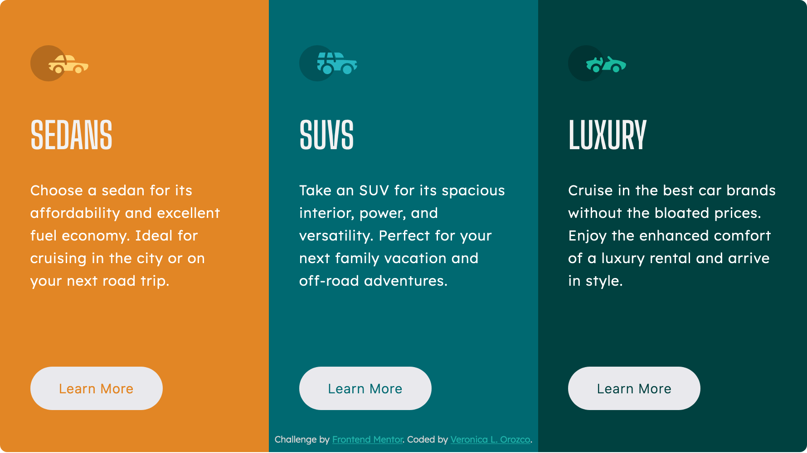

# Frontend Mentor - 3-column preview card component solution

This is a solution to the [3-column preview card component challenge on Frontend Mentor](https://www.frontendmentor.io/challenges/3column-preview-card-component-pH92eAR2-). Frontend Mentor challenges help you improve your coding skills by building realistic projects. 

## Table of contents

- [Frontend Mentor - 3-column preview card component solution](#frontend-mentor---3-column-preview-card-component-solution)
  - [Table of contents](#table-of-contents)
  - [Overview](#overview)
    - [The challenge](#the-challenge)
  - [Screenshot](#screenshot)
    - [Mobile View](#mobile-view)
    - [Desktop View](#desktop-view)
  - [Built with](#built-with)
  - [Links](#links)
  - [Author](#author)

---
## Overview

### The challenge

Users should be able to:

- View the optimal layout depending on their device's screen size
- See hover states for interactive elements

---
## Screenshot

### Mobile View

### Desktop View

---

## Built with

- HTML5
- CSS
- CSS Flexbox
- Mobile-first workflow

---

## Links

- Solution URL: [Github Code](https://github.com/VLOrozco/Mobile-first-3-column-preview-card-component.git)
- Live Site URL: [Moble-first-3-column-preview-card-component](https://vlorozco.github.io/Mobile-first-3-column-preview-card-component/)

---
## Author

- Github - [Veronica L. Orozco](https://github.com/VLOrozco)
- Frontend Mentor - [@VLOrozco](https://www.frontendmentor.io/profile/VLOrozco)
- Codecademy - [orozcov3](https://www.codecademy.com/profiles/orozcoV3)